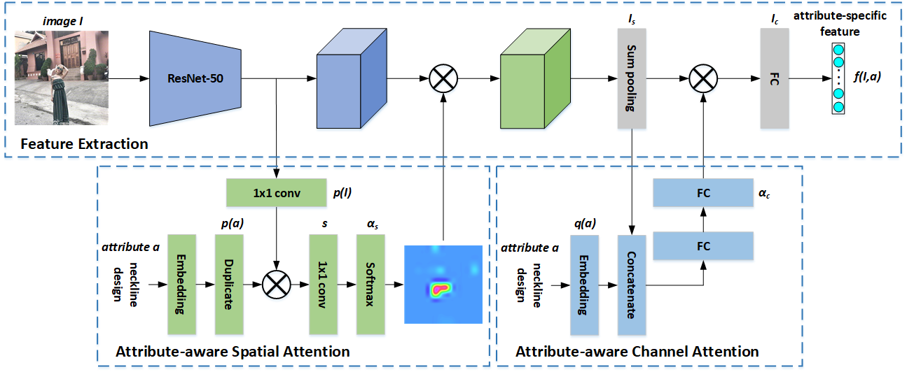

# Attribute-Specific Embedding Network

This repository is a [PyTorch]( https://pytorch.org/ ) implementation of **Attribute-Specific Embedding Network (ASEN)** proposed in our paper [*Fine-Grained Fashion Similarity Learning by Attribute-Specific Embedding Network*](https://arxiv.org/abs/2002.02814) accepted by AAAI 2020.

## Network



## Requirements

### Environments

* PyTorch 1.1.0
* CUDA 10.1.168
* Python 3.6.2

We use anaconda to create our experimental environment. You can rebuild it by the following commands.

```sh
conda create -n {your_env_name} python=3.6
conda activate {your_env_name}
pip install -r requirements.txt
...
conda deactivate
```

### Download Data

#### Dataset Split

We supply our dataset split and some descriptions of the datasets with a bunch of meta files. Download them by the following script.

```sh
wget -c -P data/ http://www.maryeon.com/file/release/meta_data.tar.gz
cd data/
tar -zxvf meta_data.tar.gz
```

#### FashionAI Dataset

As the full FashionAI has not been publicly released, we utilize its early version for the [FashionAI Global Challenge 2018](https://tianchi.aliyun.com/markets/tianchi/FashionAI). You can first sign in and download the data. Once done, you should uncompress them into the `FashionAI` directory:

```sh
unzip fashionAI_attributes_train1.zip fashionAI_attributes_train2.zip -d {your_project_path}/data/FashionAI
```

#### DARN Dataset

As some images’ URLs have been broken, only 214,619 images are obtained for our experiments. We provide with a series of [URLs](http://www.maryeon.com/file/release/darn_url.txt) for the images.

#### DeepFashion Dataset

[DeepFashion](https://www.cv-foundation.org/openaccess/content_cvpr_2016/papers/Liu_DeepFashion_Powering_Robust_CVPR_2016_paper.pdf) is a large dataset which consists of four benchmarks for various tasks in the field of clothing including [category and attribute prediction](http://mmlab.ie.cuhk.edu.hk/projects/DeepFashion.html) which we use for our experiments, in-shop clothes retrieval, fashion landmark detection and consumer-to-shop clothes retrieval.

#### Zappos50k Dataset

We utilize identical split provided by [Conditional SImilarity Network](https://arxiv.org/abs/1603.07810). To download the Zappos50k dataset and their triplet list, please refer to [their repository](https://github.com/andreasveit/conditional-similarity-networks).

## Getting Started

All data prepared, you can simply train the model on FashionAI dataset(default)

```sh
python asen.py --dataset FashionAI
```

there are also optional arguments for dataset, initial learning rate, batch size and so on. Check them by 

```sh
python asen.py --help
```

## Testing

As training terminates, two snapshots are saved for testing. One is the model that has the highest performance on validation set and the other is the one of the latest epoch. You can load any of them and test on the test set.

```sh
python asen.py --test [--dataset xx] --resume runs/{your_exp_name}/xx.pth.tar
```

## Citing

If it's of any help to your research, consider citing our work:

```latex
@inproceedings{ma2020fine,
  title={Fine-Grained Fashion Similarity Learning by Attribute-Specific Embedding Network},
  author={Ma, Zhe and Dong, Jianfeng and Long, Zhongzi and Zhang, Yao and He, Yuan and Xue, Hui and Ji, Shouling},
  booktitle={Thirty-fourth AAAI Conference on Artificial Intelligence},
  year = {2020}
}
```